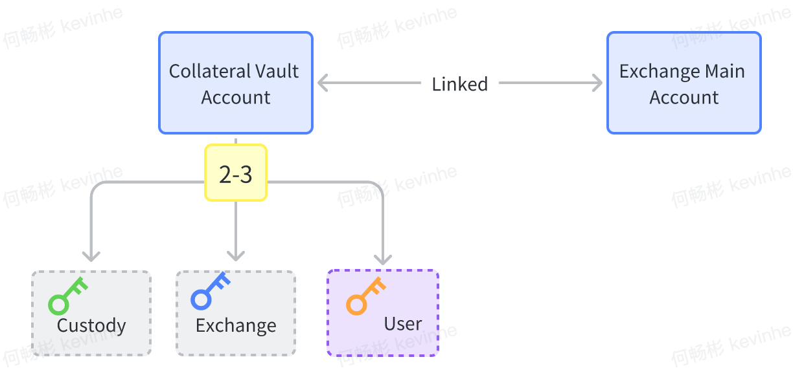
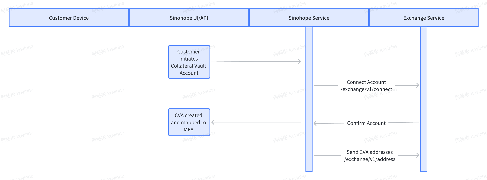
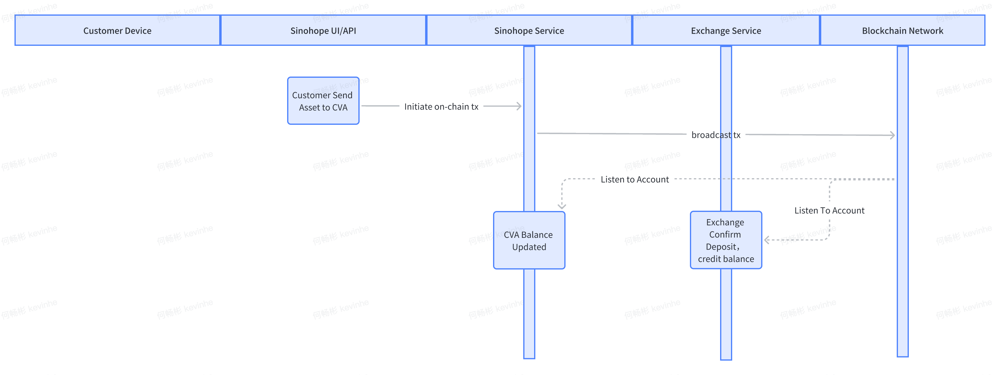
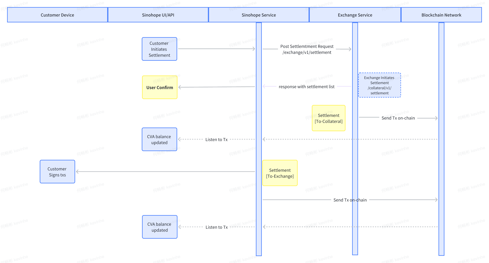
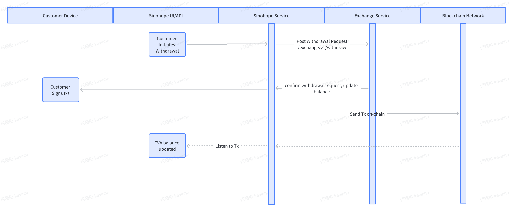

# Changelog

| 版本 | log           | 时间       | 修改人 |
| ---- | ------------- | ---------- | ------ |
| v1.0 | first version | 2023-03-12 | kevin  |

# Versions

[English Version](./README.md)


# 名词解析

角色：用户 U、交易所 E、托管平台C。

Main Exchange Account：简写为 MEA。是用户U 在交易所开设的一个账户，通常使用 appkey 来唯一标识。

Callateral Vault Account：简写为CVA。当用户U需要映射资产到交易所E，在托管平台C上创建 CVA。CVA 与MEA 实现一一映射。CVA 的唯一 ID 是 collateral_Id。

# 核心流程

## 初始化





## 充值



## 结算



## 提现



# API  设计

## Custody->Exchange

### /exchange/v1/connect

```
Description: connect the colleteralId with appkey
Method: POST
Query parameter：
collateralId: collateral account id
exchangeAccountId: exchange account id, can be appkey
Response:
{
status,
collateralId,
rejectReason,
}
```

### /exchange/v1/address

```
Description: notify the exchange to collateral asset address
Method: POST
Body parameter：
collateralId: collateral account id
assets:[
{
currency,
network,
assetId,
address,
tag,
}
]
```

### /exchange/v1/withdraw

```
Description: initiate withdrawal request from CVA, if exchange confirm, it will reduce the customer available amount in MEA
Method: POST
Body parameter：
collateralId: collateral account id
collateralTxId:
assetId
amount
to
tag
```

### /exchange/v1/settlement/list

```
description: get settlement list of the collateral id
method：GET
query parameter：
txId：custody tx id
collateralId: collateral account id
response:

{
to_exchange:[
    {
         assetid,
         amount,
         to,
         totag,
         status   
    }
],
to_collateral:[

]
}
```

### /exchange/v1/settlement/status

```
Description: get status of a settlement
Method：GET
Query parameter：
settlementId required: settlement id

Response:
"NOT_FOUND" 
"PROCESSING" 
"CANCELLED" 
"FAILED" 
"PENDING_MANUAL_APPROVAL" 
"PENDING_SERVICE_MANUAL_APPROVAL" 
"REJECTED" "COMPLETED"
```

### /exchange/v1/settlement

```
Description: send settlement request to exchange, for
Method：POST
Query parameter：
collateralId required: collateral account id
```

## Exchange->Custody

### /collateral/v1/transactions

```
Description: get status of custody tx
Method：GET
Query parameter：
txId requred：custody tx id
```

### /collateral/v1/settlement

```
Description: send settlement request to custody, for the collateralId
Method：POST
Query parameter：
collateralId required: collateral account id
```
